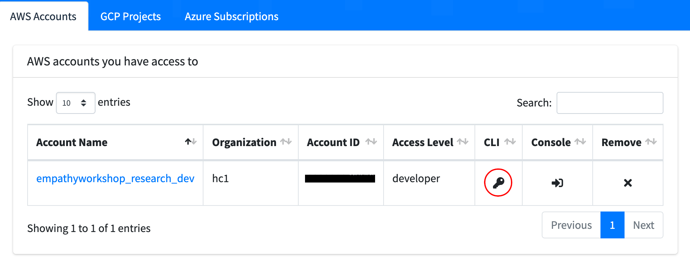
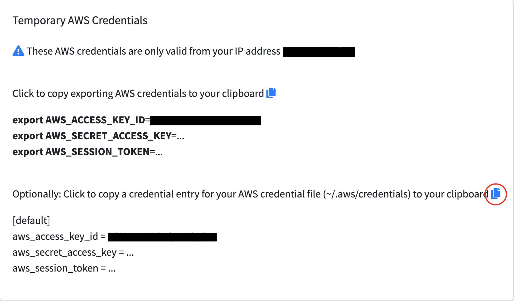

# Customer Empathy Workshop

This repository holds the Terraform configuration files you will need to get started in the customer empathy session on state migration!

## What does this provision?

These configuration files produce the base starting point of our infrastructure:

- An S3 Bucket to store our Terraform statefile.
- A DynamoDB table to manage our Terraform state locking.
- A simple VPC 
- Two NAT Gateways
- Two EC2 instances in that VPC that will serve as our example database and web application servers.

## Setup

### Doormat credentials

You should have been given access to a set of Doormat credentials prior to this session. If you don't have access to the AWS account for this session, please speak to a session facilitator. 

To find your AWS credentials, click the following key icon



Which will take you to this page. We recommend copying the credentials to `$HOME/.aws/credentials`. 



Rename `[default]` to `[customer-empathy]` so it does not conflict if you already have a default profile.

### Provisioning

1. Clone this repository and run `terraform init`.

2. After initializing your root module, we'll need to modify our configuration to authenticate the AWS Terraform provider.

In `provider.tf`, modify the provider block to reference your Doormat credentials. There are many different ways to authenticate the provider so feel free to choose a method that suits you best. 

```hcl
provider "aws" {
  region = "us-east-1"
  # Add your credentials here
  access_key = "<YOUR-DOORMAT-ACCESS-KEY>"
  secret_key = "<YOUR-DOORMAT-SECRET-KEY"
  token = "<YOUR-DOORMAT-SESSION-TOKEN>"
  # OR
  # Set them as env vars, AWS_ACCESS_KEY_ID, AWS_SECRET_ACCESS_KEY, AWS_SESSION_TOKEN
  # OR
  # profile = "customer-empathy"
  # For more information: https://registry.terraform.io/providers/hashicorp/aws/latest/docs#authentication-and-configuration
}
```

3. Once you've configured your provider, we can go ahead and run `terraform plan` to see all the new resources that will be created. Furthermore, it will help us catch any errors should they arise.

4. Once `terraform plan` is successful, we can go ahead and apply our desired infrastructure changes: `terraform apply` and enter `yes` when prompted.

5. This may take a while, so sit back and relax! 

6. Once the changes have been applied we'll have our statefile stored locally. You'll notice there is an output in the form:
```
Outputs:

random_int_suffix = "7289"
```

Well use this value to specify our bucket in the S3 backend configuration. You might have noticed the backend configuration is commented out in `main.tf`. In order to migrate our statefile to an S3 bucket we'll need to uncomment that block and replace `{RANDOM_NUMBER_HERE}` with the integer value of the output `random_int_suffix`. 

7. Run `terraform init` again, this time Terraform will notice that there's been a change in the backend configuration from `local` to `S3`. Enter `yes` when asked if Terraform should perform a state migration.

8. Once completed you have now migrated your Terraform statefile to S3 and you are ready to begin the customer empathy session exercise.

## Cleanup 

Once the session is over, you'll need to destroy all the resources you've provisioned:

1. We first want to migrate back to the `local` backend -- you can do so by commenting out the backend configuration in `main.tf`. Run `terraform init -migrate-state` which will unset the current backend. Type "yes" when prompted.

2. Once the backend has been unset, you can now go ahead and delete your resources using `terraform destroy`. If you encounter any errors during the process please let a session facilitator know so they can go ahead and nuke the resources that failed to delete.
